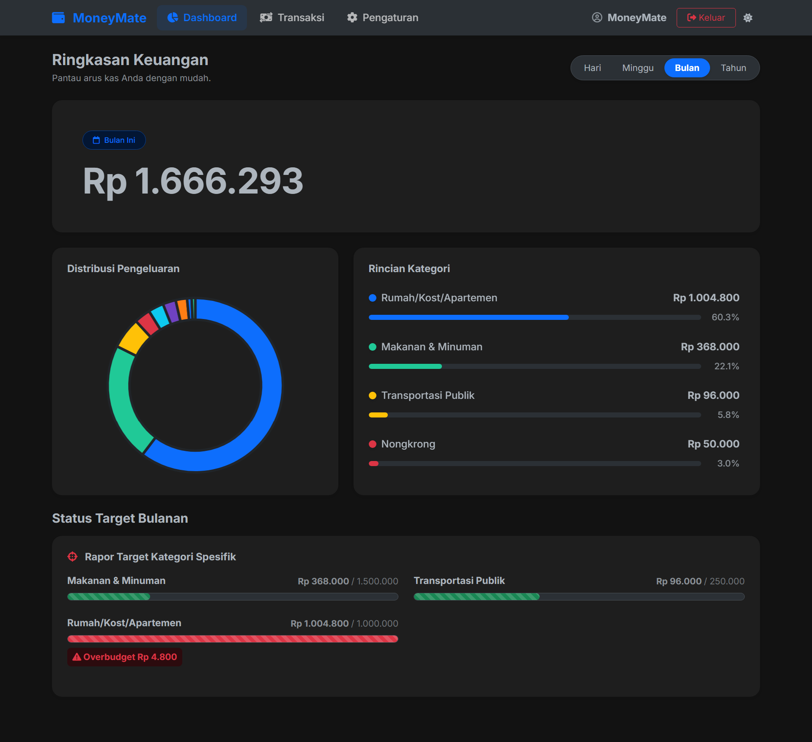

# 💸 MoneyMate

> **MoneyMate** adalah aplikasi pencatatan keuangan pribadi (_Personal Expense Tracker_) berbasis web yang dirancang untuk membantu pengguna memantau arus kas, mengatur target pengeluaran, dan menganalisis kebiasaan finansial mereka secara efisien dan intuitif.



## ✨ Fitur Utama

- **📊 Dashboard Interaktif:** Pantau ringkasan keuangan Anda (Hari Ini, Minggu Ini, Bulan Ini, Tahun Ini) dilengkapi dengan grafik distribusi pengeluaran berbasis Chart.js.
- **📝 Pencatatan Cepat & Mudah:** Catat pengeluaran harian Anda dengan kategori yang bisa disesuaikan, fitur pencarian kategori (_live search_), dan format angka rupiah otomatis.
- **🎯 Manajemen Target Anggaran:** Atur batas pengeluaran global bulanan atau batas spesifik per kategori (misal: khusus Makanan). Aplikasi akan memberikan peringatan visual jika pengeluaran mendekati atau melebihi target (_Overbudget_).
- **📂 Filter & Ekspor Data:** Saring riwayat transaksi berdasarkan periode waktu dan kategori, lalu ekspor laporan keuangan Anda dalam format **PDF**.
- **🔑 Fitur Lupa Password OTP:** Sistem pemulihan akun yang aman menggunakan kode OTP (One-Time Password) yang dikirimkan langsung ke email pengguna.
- **🔒 Keamanan Akun:** Fitur manajemen profil dan pembaruan _password_ terenkripsi untuk menjaga keamanan data pengguna.
- **📱 Desain Responsif:** Antarmuka pengguna yang bersih, modern, dan sepenuhnya responsif di perangkat _mobile_ maupun _desktop_.

## 🛠️ Tech Stack

Aplikasi ini dibangun menggunakan teknologi modern dan kokoh:

- **Framework:** [Laravel 11](https://laravel.com/)
- **Frontend:** HTML5, CSS3, [Bootstrap 5](https://getbootstrap.com/)
- **Livewire & Alpine.js:** [Livewire Volt](https://livewire.laravel.com/docs/volt)
- **Database:** MySQL / PostgreSQL
- **PDF Generation:** [barryvdh/laravel-dompdf](https://github.com/barryvdh/laravel-dompdf)
- **Charts:** [Chart.js](https://www.chartjs.org/)

## 🚀 Instalasi & Menjalankan Aplikasi Lokal

Ikuti langkah-langkah berikut untuk menjalankan MoneyMate di mesin lokal Anda.

### Prasyarat

- PHP >= 8.2
- Composer
- Node.js & NPM
- MySQL / PostgreSQL

### Langkah-langkah

1. **Clone Repositori**
    ```bash
    git clone https://github.com/RegaAnton/MoneyMate.git
    cd moneymate
    ```
2. **Install Dependensi PHP**
    ```bash
    composer install
    ```
3. **Install Dependensi Frontend**
    ```bash
    npm install
    npm run build
    ```
4. **Konfigurasi Environment**
    ```bash
    cp .env.example .env
    ```
    Buka file .env dan atur koneksi database Anda:
    ```bash
    DB_CONNECTION=mysql
    DB_HOST=127.0.0.1
    DB_PORT=3306
    DB_DATABASE=moneymate_db
    DB_USERNAME=root
    DB_PASSWORD=
    ```
5. **Generate Application Key**
    ```bash
    php artisan key:generate
    ```
6. **Jalankan Migrasi Database**
    ```bash
    php artisan migrate
    ```
7. **Jalankan Development Server**
    ```bash
    php artisan serve
    ```

## 📁 Struktur Database Utama

- **Users:** Menyimpan kredensial pengguna dan target anggaran bulanan global (monthly_budget).
- **Categories:** Menyimpan daftar kategori pengeluaran standar (Makanan, Transportasi, dll).
- **Expenses:** Menyimpan riwayat pencatatan transaksi harian beserta relasi ke users dan categories.
- **Category_budgets:** Menyimpan pengaturan target anggaran spesifik per kategori yang diatur oleh pengguna.

## 🤝 Kontribusi

Kontribusi selalu diterima! Jika Anda ingin menambahkan fitur, memperbaiki bug, atau meningkatkan dokumentasi, silakan ikuti langkah berikut:

1. **Fork repositori ini.**
2. **Buat branch fitur Anda**
    ```
    git checkout -b feature/FiturBaru
    ```
3. **Commit perubahan Anda**
    ```
    git commit -m 'Menambahkan Fitur Baru'
    ```
4. **Push ke branch tersebut**
    ```
    git push origin feature/FiturBaru
    ```
5. **Buat Pull Request.**

## 📄 Lisensi

Proyek ini berada di bawah lisensi MIT License. Silakan gunakan dan modifikasi sesuai kebutuhan Anda.

Dibuat dengan ❤️ oleh _Rega Anton Giapierro_
